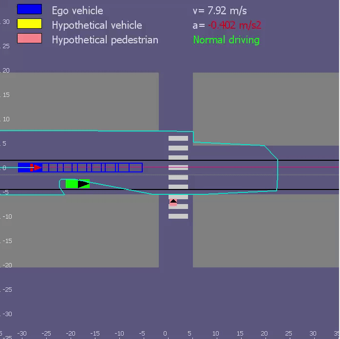
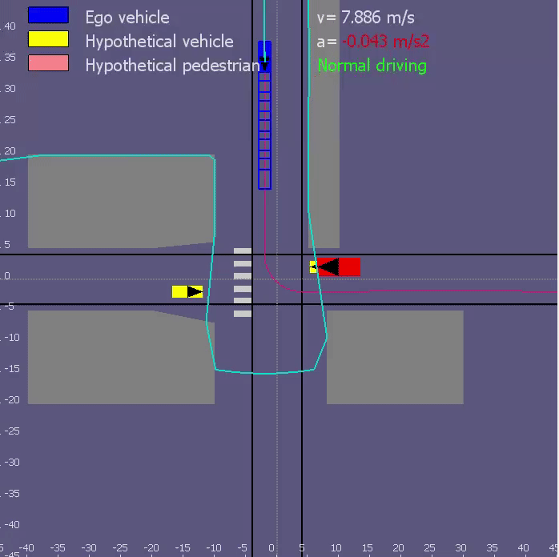
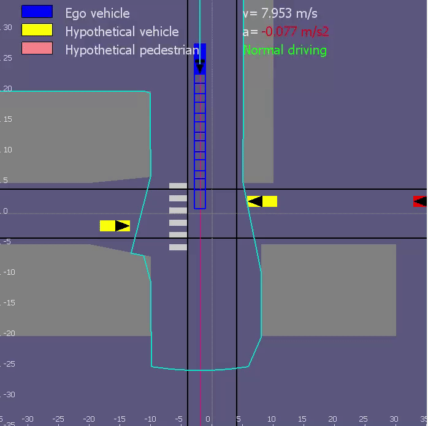
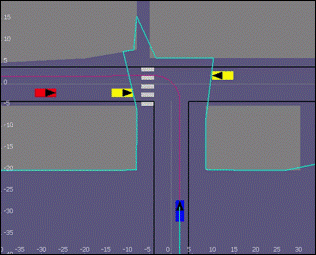
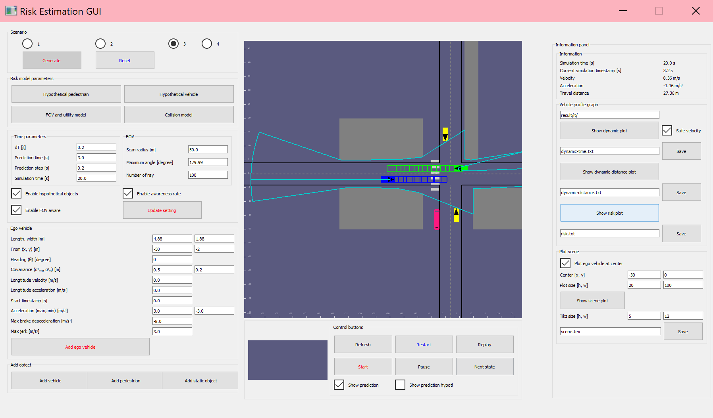

[](https://opensource.org/licenses/MIT)  

Simulator for behavior planning under occlusion
==========

This is my master thesis project `Risk-based behavior planning for occluded scenarios` at [RMR TU Darmstadt](https://www.rmr.tu-darmstadt.de/rmr/aktuelles_rmr/index.de.jsp#/veranstaltungen)

## Demo
<p align="left">
  
  
</p>
<p align="left">
  
  
</p>


## Setup
1) Install dependencies from the `requirements.txt` using:
```
pip install -r requirements.txt

```

2) Open the simulator at the main directory using: 
```
python main.py

```

### GUI
<p align="center">
  
</p>

## Usage


